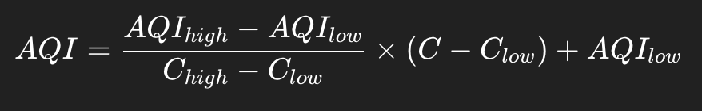

# AQI-Agent

AQI-Agent is a simple Python-based air quality monitoring tool that:

- Fetches PM2.5 pollutant data from the OpenWeatherMap Air Pollution API  
- Computes AQI using US EPA standards  
- Displays the health category of air quality  

This agent converts raw pollution data into meaningful health insights.

---

## Features

- Fetches real-time air pollution data  
- Calculates AQI using US EPA breakpoints  
- Classifies air quality into health categories  
- Lightweight and easy to run  
- Works for any geographic coordinates  

---

## Requirements

1. Python 3.x  
2. `requests` library  

Install dependencies:
```
pip install requests
```

---

## API Setup

This project uses the OpenWeatherMap Air Pollution API.

### Step 1: Get API Key

1. Go to [OpenWeatherMap](https://openweathermap.org/api)  
2. Create an account  
3. Generate an API Key  

---

### Step 2: Set Environment Variable

**Linux / Mac**
```
export API_KEY="your_api_key_here"
```
**Windows (CMD)**
```
set API_KEY=your_api_key_here
```
**Windows (PowerShell)**
```
$env:API_KEY="your_api_key_here"
```

---

## Configure Location

Edit the coordinates in the script:
```
LAT = 25.7642647
LON = -80.802024966
```
You can replace these with any location's latitude & longitude.

---

## Run the Agent
```
python3 aqi_agent.py
```

---

# How It Works

## Step 1: Fetch Pollution Data
The agent calls:
```
https://api.openweathermap.org/data/2.5/air_pollution
```

It retrieves pollutant concentration levels including:
- PM2.5
- PM10
- CO
- NO2
- SO2
- O3

We use:
```
pm2_5
```

---

## Step 2: Compute AQI
AQI is calculated using US EPA breakpoint formula:



Where:
- 𝐶 = PM2.5 concentration
- Breakpoints define health risk levels

---

## Step 3: Categorize Health Impact

| AQI Range | Category |
|-----------|----------|
| 0–50      | Good |
| 51–100    | Moderate |
| 101–150   | Unhealthy for Sensitive Groups |
| 151–200   | Unhealthy |
| 201–300   | Very Unhealthy |
| 301–500   | Hazardous |